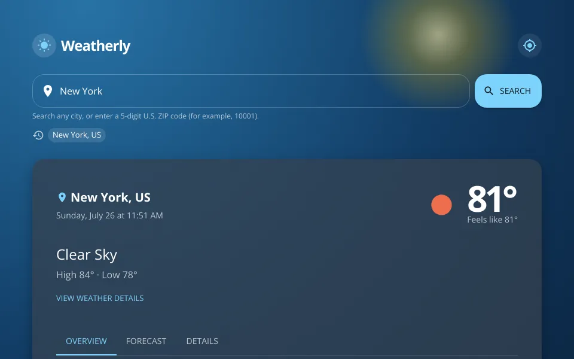

# Weatherly

> A polished, responsive weather dashboard built with React, Material UI, and
> OpenWeather.

[View the live app](https://weatherly-dashboard-wyu6609.netlify.app)



## Highlights

- Search by city, 5-digit U.S. ZIP code, or device location
- Condition-aware animated backgrounds for clear, cloudy, rainy, snowy, and
  stormy weather
- Current conditions, local time, sunrise/sunset, air quality, and expanded
  weather data
- Five-day outlook and near-term hourly forecast
- Recent locations stored locally for quick revisits
- Responsive mobile layout with touch-scrollable forecast cards

## Tech stack

| Area | Technology |
| --- | --- |
| UI | React 19 + Material UI |
| Tooling | Vite |
| Weather data | OpenWeather |
| Secure API proxy | Netlify Functions |
| Hosting | Netlify |

## Architecture

The browser never receives the OpenWeather API key. Requests flow through
`netlify/functions/weather.mjs`, which reads `OPENWEATHER_API_KEY` from the
Netlify Function environment and forwards only the required weather data.

```text
React client -> Netlify Function -> OpenWeather API
```

## Run locally

1. Install dependencies:

   ```bash
   npm install
   ```

2. Create a local environment file:

   ```bash
   copy .env.example .env
   ```

3. Set `OPENWEATHER_API_KEY` in `.env`.
4. Start the Netlify development server:

   ```bash
   npm run dev
   ```

Open http://127.0.0.1:8888.

## Deploy to Netlify

`netlify.toml` builds the Vite app with Node 22, publishes `dist`, and deploys
the weather function. In Netlify, add `OPENWEATHER_API_KEY` as a secret
environment variable for the **Production** context and **Functions** scope.
